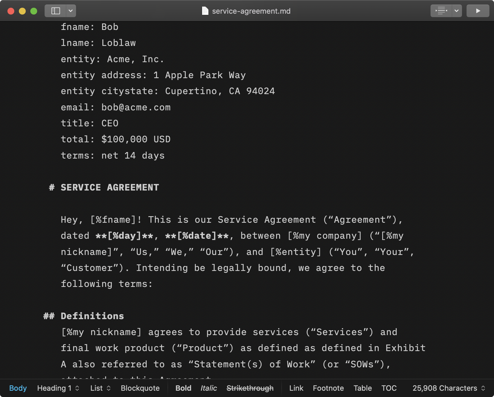
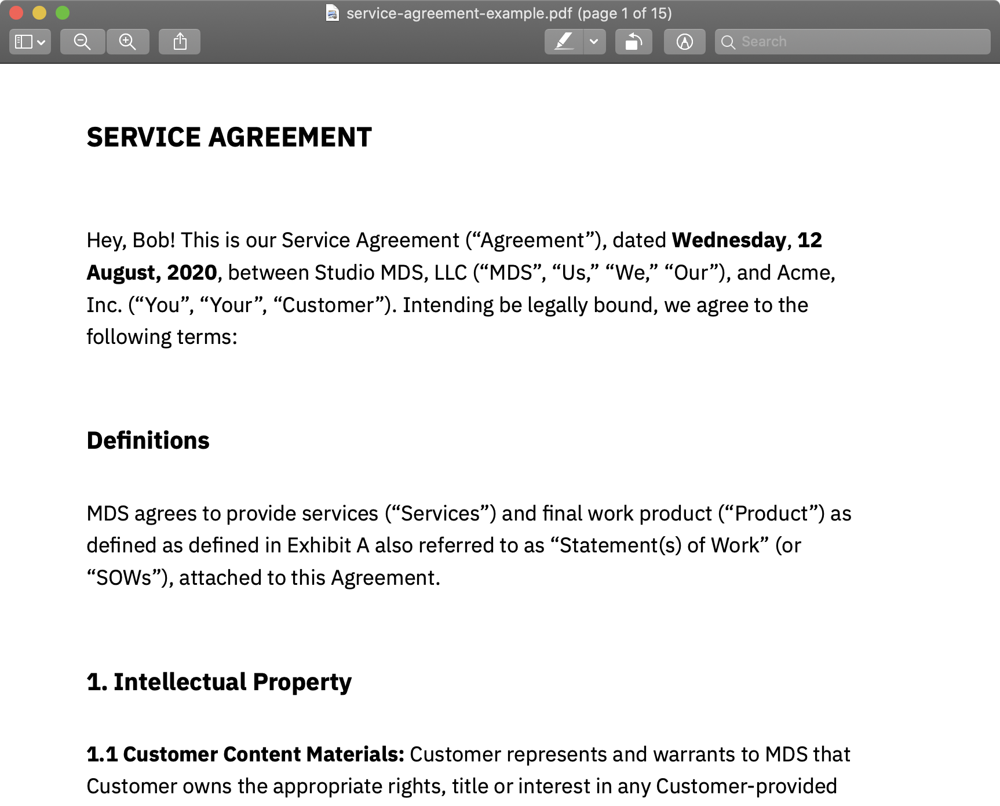

# Service Agreement

This is a legal agreement I had drafted a long time ago by a former director of legal at a creative agency, for my design contracts. Over the years I've rewritten parts of it myself and had another lawyer review it for different clients, etc. 

I got tired of editing a Microsoft word document, so I reformatted everything in markdown to work with iA writer's variable.

## How to use it
1. Use [iA writer](https://iawriter.com) to edit `service-agreement.md`
2. Edit the variables at the top of the document to update the agreement details.
3. Update the Exhibit A and B sections, which include the statement of work, payment schedule, list of deliverables, etc.
4. Export as a PDF from iA writer. See `service-agreement-example.pdf` for a demo.

Visit [iA writer's website for support](https://ia.net/writer/support)

## DISCLAIMER
The information provided does not, and is not intended to, constitute legal advice; instead, all information, content, and materials available are for general informational purposes only. Information may not constitute the most up-to-date legal or other information.

Readers should contact their attorney to obtain advice with respect to any particular legal matter. No reader, user, or browser of this content should act or refrain from acting on the basis of information on this site without first seeking legal advice from counsel in the relevant jurisdiction. Only your individual attorney can provide assurances that the information contained herein—and your interpretation of it—is applicable or appropriate to your particular situation. Use of, and access to, this document or any of the links or resources contained within do not create an attorney-client relationship between the reader, user, or browser and authors, contributors, contributing law firms, or committee members and their respective employers. 

The views expressed at, or through, this site are those of the individual authors writing in their individual capacities only – not those of their respective employers. All liability with respect to actions taken or not taken based on the contents of this site are hereby expressly disclaimed. The content on this posting is provided "as is;" no representations are made that the content is error-free.